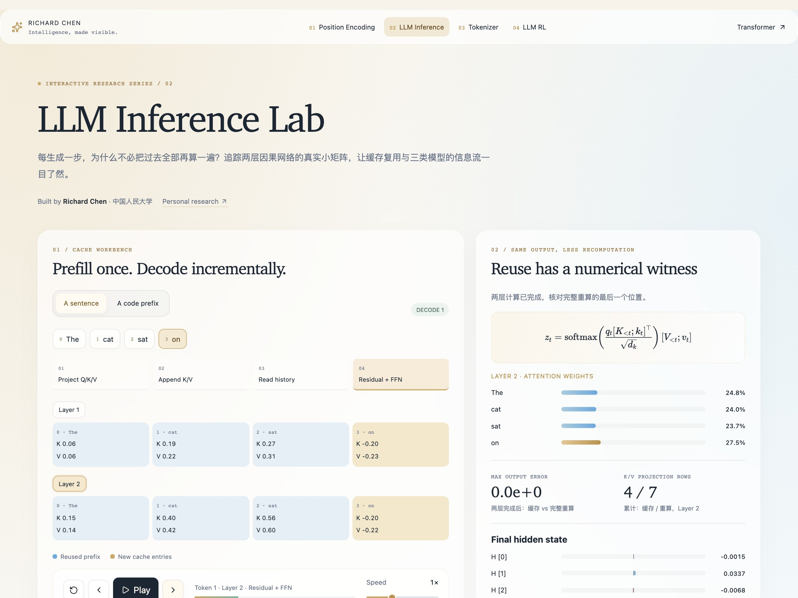
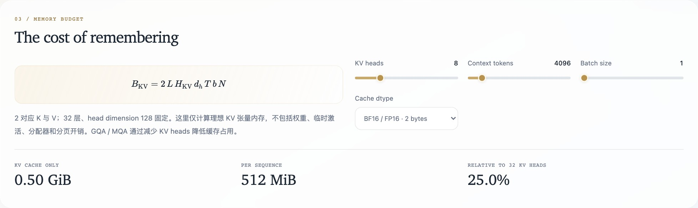
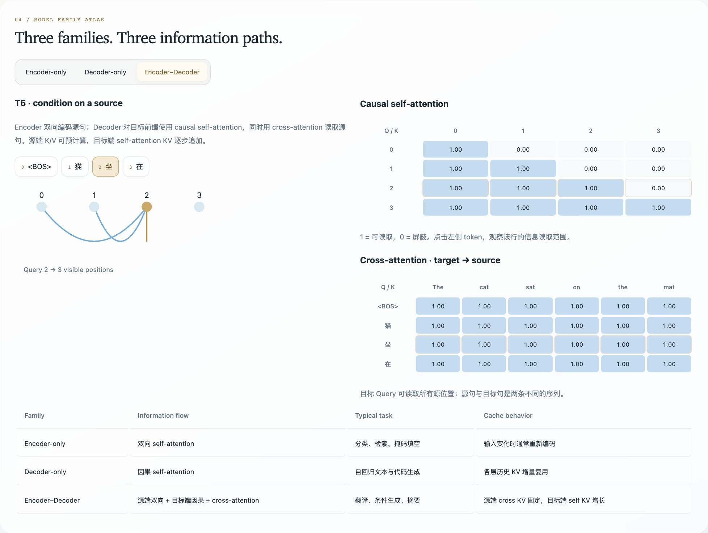

# LLM Inference Lab

**Understand KV Cache reuse and computational cost, layer by layer.**

Follow KV caching layer by layer, compare cached decoding with full-prefix recomputation, and connect the result to attention masks and model families. A small deterministic network makes the equivalence directly inspectable.

[**Open the lab ↗**](https://richardchen99.github.io/llm-inference-lab/) · [Research note · 中文](https://richardchen99.github.io/blog/llm-inference-lab-note/) · [简体中文](README.md) · [Quick start](#quick-start)

Created by **Richard Chen · Renmin University of China / 中国人民大学** · [Homepage](https://richardchen99.github.io)

[](https://richardchen99.github.io/llm-inference-lab/)

*Real application capture after the first continuation token completes both layers: the cache and full-prefix paths agree at display precision.*

## Four connected experiments

| Workbench | Intervention | Evidence |
| --- | --- | --- |
| **Cache execution** | Step through Q/K/V, append, history read, and residual/FFN | Each layer updates only when its input becomes available |
| **Numerical equivalence** | Compare independent cached and full-prefix paths | Inspect the final hidden-state difference |
| **Memory budget** | Change context length, KV heads, dtype, and batch | See how cache tensor storage scales |
| **Model family atlas** | Select Encoder-only, Decoder-only, or Encoder–Decoder | Inspect allowed attention paths and which states can remain fixed |

Sentence and code examples use prescribed continuations: `The cat sat → on the mat .` and `def square(x): → return x * x`. They provide repeatable inputs for checking computation. The interface uses English controls and Chinese explanations.

## From information flow to reuse


*Original schematic: causal structure explains reuse; an independent forward path checks it. [Editable SVG](docs/assets/architecture.en.svg) · [Figure provenance · 中文](docs/assets/README.md).*

## Follow one new token

1. Select the sentence example and step through **prefill**. Both layers receive the prefix K/V.
2. Continue with `on`. In Layer 1, **Append K/V** adds the new position to that layer alone.
3. At **Read history**, inspect how the new Query attends to previous keys and the current key.
4. Complete Layer 1, then Layer 2. The final hidden state and the cached/full-prefix error appear only after both layers finish.
5. Open the family atlas. A bidirectional encoder may change historical states after an append; a causal decoder preserves them. In encoder–decoder models, fixed-source cross-attention K/V differs from growing target self-attention K/V.

The model tests require cached and full-prefix outputs to agree within **1e-12**. A zero shown in the interface reflects display precision, not a claim about every production implementation.

<details>
<summary><strong>Inspect memory scaling and model families</strong></summary>



*This configuration uses 512 MiB for K/V tensors alone.*



*The family atlas separates source-side cross-attention from target-side causal self-attention.*

</details>

## Mathematical scope

At a new causal position:

$$
z_t=\mathrm{softmax}\left(
\frac{q_t[K_{1:t-1};k_t]^\top}{\sqrt{d_k}}
\right)[V_{1:t-1};v_t].
$$

With a fixed prefix, parameters, position rules, and deterministic forward pass, causal masking leaves historical states unchanged when future tokens are appended. The argument applies layer by layer. **The new Query still reads a growing history**; caching does not make attention cost constant.

The demonstrator has **2 layers, 4 dimensions, and 1 attention head**, with fixed token/position representations, Q/K/V projections, causal attention, residuals, and a per-position nonlinear FFN. It has no trained weights, LayerNorm, or LM head. Continuations are prescribed rather than sampled from a language model.

The separate memory panel uses 32 layers and head dimension 128:

$$
B_{\mathrm{KV}}=2LH_{\mathrm{KV}}d_hTsN.
$$

Here, $L$ is layer count, $H_{\mathrm{KV}}$ KV heads, $d_h$ head dimension, $T$ cached length, $s$ bytes per element, and $N$ batch size. The factor two accounts for Keys and Values.

For $L=32$, $H_{\mathrm{KV}}=8$, $d_h=128$, $T=4096$, $s=2$, and $N=1$, the result is **536,870,912 bytes = 512 MiB**. Weights, temporary activations, paging/allocator overhead, and quantization metadata are excluded. INT8 represents ideal tensor storage.

## Quick start

Use **Node.js 24**; the supported minimum is 22.12.

```bash
git clone https://github.com/richardchen99/llm-inference-lab.git
cd llm-inference-lab
npm ci
npm run dev -- --host 127.0.0.1
```

```bash
npm test
npm run build
npm run preview -- --host 127.0.0.1
```

All experiment calculations run in the browser; no inference service, API key, or GPU is required. Built with React 19, TypeScript, Vite, Framer Motion, and KaTeX.

## Implementation and verification

| Entry point | Responsibility |
| --- | --- |
| [`src/model.ts`](src/model.ts) | Full and incremental forward passes, execution traces, masks, and memory accounting |
| [`src/App.tsx`](src/App.tsx) | Layer/stage state machine, cache lanes, family atlas, and controls |
| [`src/shared.tsx`](src/shared.tsx) · [`src/style.css`](src/style.css) | Formulas, animation, glass panels, and reduced-motion support |
| [`tests/model.test.mjs`](tests/model.test.mjs) | Forward equivalence, causal-history invariance, a bidirectional counterexample, bytes, and masks |

`npm test` compiles the model and runs the Node test runner. The [Pages workflow](.github/workflows/deploy.yml) tests, type-checks, builds, and deploys `main` using Node 24. For a fork, select **GitHub Actions** as the Pages source.

## Reading and citation

- Vaswani et al. [*Attention Is All You Need*](https://arxiv.org/abs/1706.03762), 2017 — attention and encoder–decoder structure.
- Hugging Face. [*Cache strategies*](https://huggingface.co/docs/transformers/kv_cache) — practical cache implementations and tradeoffs.
- Ainslie et al. [*GQA*](https://arxiv.org/abs/2305.13245), 2023 — grouped-query attention.
- [BERT](https://arxiv.org/abs/1810.04805) and [T5](https://arxiv.org/abs/1910.10683) — context for the model-family comparison.
- [Project research note](https://richardchen99.github.io/blog/llm-inference-lab-note/) — the experiment explained in Chinese.

For teaching or writing, link to this repository and record the commit used. [CITATION.cff](CITATION.cff) provides machine-readable software attribution.

## Explore the series

| Lab | Central question |
| --- | --- |
| [Tokenizer Playground](https://github.com/richardchen99/tokenizer-playground) | How does a corpus become a reusable vocabulary? |
| [Transformer Architecture Lab](https://github.com/richardchen99/transformer-architecture-lab) | How does attention turn token representations into context? |
| [Position Encoding Lab](https://github.com/richardchen99/position-encoding-lab) | How does position change attention geometry? |
| **LLM Inference Lab** | When can past computation be reused? |
| [LLM RL Lab](https://github.com/richardchen99/llm-rl-lab) | How does reward change a response distribution? |

Found it useful? A star helps others discover the series. Reproducible cache experiments and improvements to the numerical checks are welcome.
