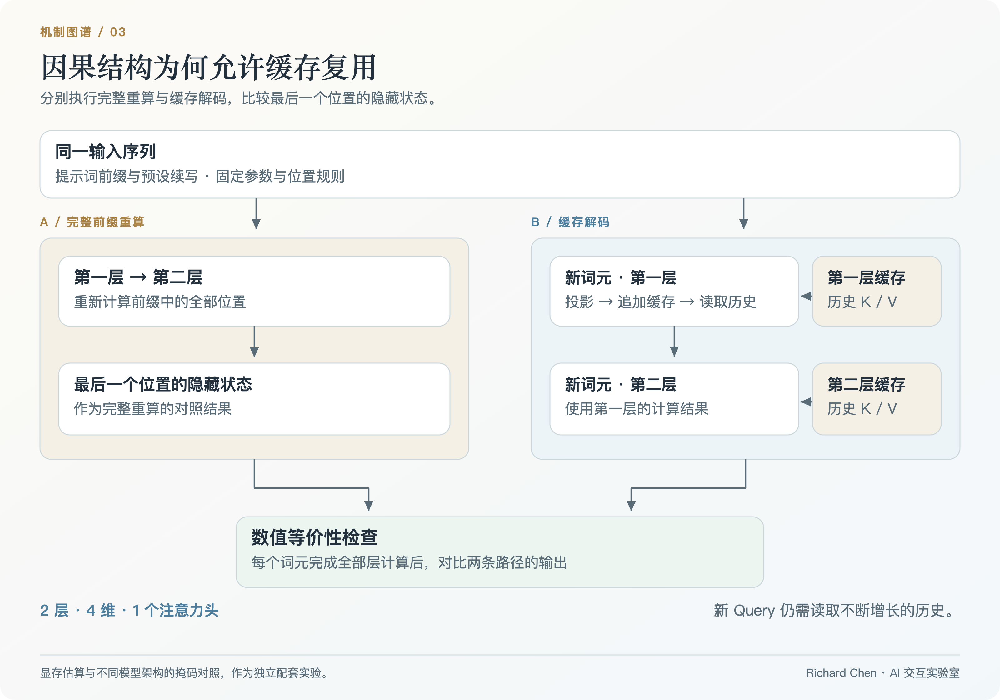

# LLM Inference Lab

**逐层理解 KV Cache 的复用机制与计算代价。**

逐层观察 KV Cache，将增量解码与完整前缀重算逐项对照，再用注意力掩码解释不同模型架构的差异。通过一个小型确定性网络，直接检查缓存复用的数值依据。

[**进入实验室 ↗**](https://richardchen99.github.io/llm-inference-lab/) · [配套研究笔记](https://richardchen99.github.io/blog/llm-inference-lab-note/) · [English](README.en.md) · [本地运行](#本地运行)

作者：**Richard Chen · 中国人民大学** · [个人主页](https://richardchen99.github.io)

[](https://richardchen99.github.io/llm-inference-lab/)

*真实运行截图。首个续写词元完成两层计算后，缓存路径与完整重算在显示精度下一致。*

## 四个相互连接的实验

| 模块 | 操作 | 证据 |
| --- | --- | --- |
| **缓存执行** | 逐步执行 Q/K/V 投影、缓存追加、历史读取、残差与 FFN | 每一层只有在输入就绪后才更新 |
| **数值等价性** | 对比独立实现的缓存与完整重算路径 | 检查最终隐藏状态的误差 |
| **显存估算** | 改变上下文长度、KV 头数、数据类型与批大小 | 查看缓存张量的内存占用如何变化 |
| **模型架构对照** | 切换编码器、解码器与编码器—解码器架构 | 检查信息流与历史状态能否保持不变 |

句子与代码案例采用固定续写：`The cat sat → on the mat .` 和 `def square(x): → return x * x`，为数值检查提供可重复的输入。界面采用英文控件与中文解释，以下操作步骤保留控件原名，便于查找。

## 从信息流到计算复用



*原创框架图：因果结构解释复用，独立前向路径提供数值检查。[可编辑 SVG](docs/assets/architecture.svg) · [图片来源与状态](docs/assets/README.md)。*

## 跟随一个新词元

1. 选择句子案例，逐步执行预填充（**prefill**），观察两层前缀 K/V。
2. 继续到 `on`。第一层（Layer 1）的缓存追加（**Append K/V**）只向这一层写入当前词元的 K/V。
3. 到达历史读取（**Read history**），查看新 Query 对历史 Key 与当前 Key 的权重。
4. 完成第一层，再完成第二层；两层结束后才显示最终隐藏状态及缓存/重算误差。
5. 查看模型架构对照：双向编码器追加输入后可能改变历史状态，因果解码器保留历史状态。在编码器—解码器架构中，源端交叉注意力的 K/V 固定，目标端自注意力的 K/V 持续增长。

模型测试要求两条计算路径的输出误差小于 **1e-12**。界面显示零表示当前显示精度下的一致，不代表所有生产实现都具有相同误差。

<details>
<summary><strong>展开显存估算与模型架构截图</strong></summary>


*这组配置的 K/V 张量占用 512 MiB。*


*模型架构视图区分源端交叉注意力与目标端因果自注意力。*

</details>

## 数学机制与实现范围

在新的因果位置：

$$
z_t=\mathrm{softmax}\left(
\frac{q_t[K_{1:t-1};k_t]^\top}{\sqrt{d_k}}
\right)[V_{1:t-1};v_t].
$$

固定前缀、参数、位置规则与确定性前向计算时，因果掩码保证新增未来词元不改变历史位置的表示，因此可以逐层复用 K/V。**新 Query 仍需读取不断增长的历史**；缓存不会使注意力计算成本成为常数。

演示网络为 **2 层、4 维、1 个注意力头**，包含固定词元与位置表示、Q/K/V 投影、因果注意力、残差与逐位置非线性前馈网络（FFN）。没有训练权重、层归一化（LayerNorm）或语言模型输出头；续写顺序预设，不从语言模型采样。

独立的显存估算面板采用 32 层、每个注意力头 128 维的配置：

$$
B_{\mathrm{KV}}=2LH_{\mathrm{KV}}d_hTsN.
$$

其中 $L$ 为层数， $H_{\mathrm{KV}}$ 为 KV 头数， $d_h$ 为每头维度， $T$ 为缓存长度， $s$ 为每个元素的字节数， $N$ 为批大小；系数二对应 Key 与 Value。

当 $L=32$、 $H_{\mathrm{KV}}=8$、 $d_h=128$、 $T=4096$、 $s=2$、 $N=1$ 时，结果为 **536,870,912 字节，即 512 MiB**。估算不包含模型权重、临时激活、分页/分配器开销及量化元数据；INT8 代表理想张量字节数。

## 本地运行

推荐 **Node.js 24**，最低支持 22.12。

```bash
git clone https://github.com/richardchen99/llm-inference-lab.git
cd llm-inference-lab
npm ci
npm run dev -- --host 127.0.0.1
```

```bash
npm test
npm run build
npm run preview -- --host 127.0.0.1
```

实验计算在浏览器内完成，无需推理服务、API 密钥或 GPU。技术栈为 React 19、TypeScript、Vite、Framer Motion 与 KaTeX。

## 实现与验证

| 入口 | 重点 |
| --- | --- |
| [`src/model.ts`](src/model.ts) | 完整与增量前向计算、执行轨迹、掩码与内存计算 |
| [`src/App.tsx`](src/App.tsx) | 逐层执行状态、缓存通道、模型架构与参数控件 |
| [`src/shared.tsx`](src/shared.tsx) · [`src/style.css`](src/style.css) | 公式、动画、玻璃面板与减少动态效果的无障碍支持 |
| [`tests/model.test.mjs`](tests/model.test.mjs) | 路径等价、因果历史不变、双向反例、内存单位与掩码 |

`npm test` 编译计算模型后，使用 Node 内置测试运行器执行验证。[Pages 工作流](.github/workflows/deploy.yml) 使用 Node 24 完成测试、类型检查、构建与 `main` 分支部署。Fork 仓库后，在 Pages 设置中将部署来源设为 **GitHub Actions** 即可部署。

## 阅读与引用

- Vaswani 等：[Attention Is All You Need](https://arxiv.org/abs/1706.03762)，2017，注意力与编码器—解码器架构。
- Hugging Face：[Cache strategies](https://huggingface.co/docs/transformers/kv_cache)，生产缓存实现与权衡。
- Ainslie 等：[GQA](https://arxiv.org/abs/2305.13245)，2023，分组查询注意力。
- [BERT](https://arxiv.org/abs/1810.04805) 与 [T5](https://arxiv.org/abs/1910.10683)，模型家族对照阅读。
- [配套研究笔记](https://richardchen99.github.io/blog/llm-inference-lab-note/)，中文实验导读。

用于课程或文章时，可链接本仓库并记录所用提交版本。[CITATION.cff](CITATION.cff) 提供机器可读的软件署名信息。

## 系列实验室

| 项目 | 核心问题 |
| --- | --- |
| [Tokenizer Playground](https://github.com/richardchen99/tokenizer-playground) | 语料怎样变成可复用词表？ |
| [Transformer Architecture Lab](https://github.com/richardchen99/transformer-architecture-lab) | 注意力怎样将词元表示转为上下文？ |
| [Position Encoding Lab](https://github.com/richardchen99/position-encoding-lab) | 位置怎样改变注意力几何？ |
| **LLM Inference Lab** | 什么条件下可以复用历史计算？ |
| [LLM RL Lab](https://github.com/richardchen99/llm-rl-lab) | 奖励怎样改变回答分布？ |

如果它对你的学习或教学有帮助，欢迎点亮 Star。也欢迎提交可复现的缓存实验与数值检查改进。
